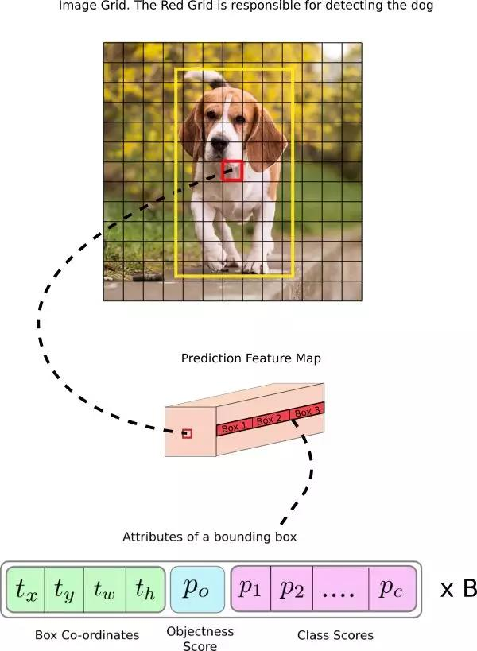
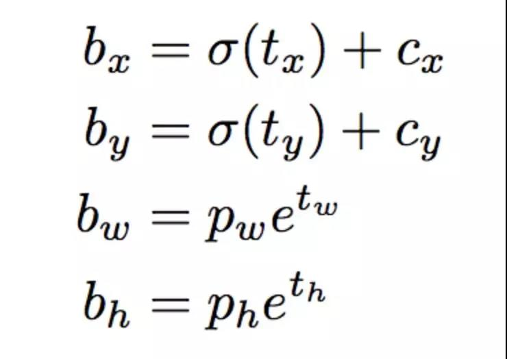
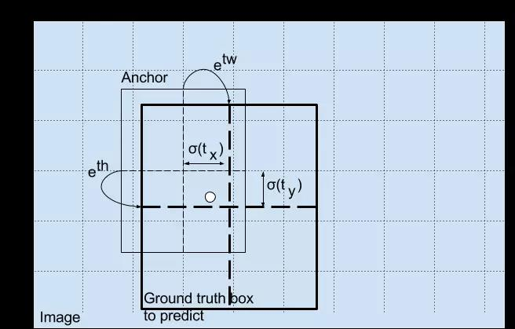
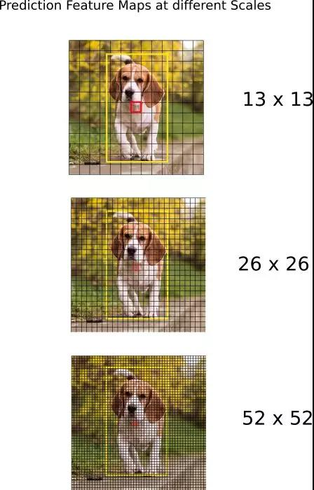
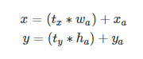
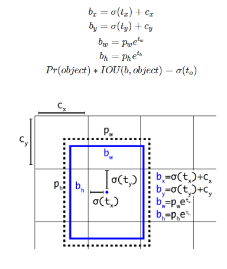
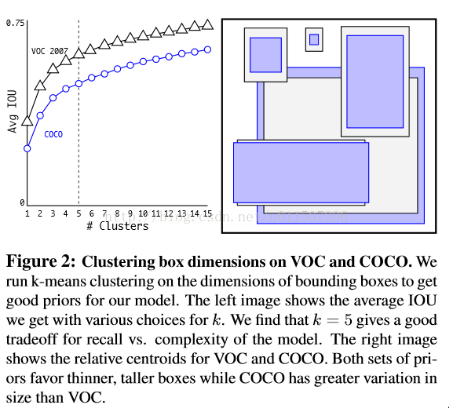
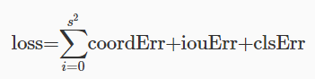

# YOLO
* YOLO拥有75个卷积层，还有跳过连接和上采样层。它不使用任何形式的池化，使用步幅为 2 的卷积层对特征图进行下采样。这有助于防止通常由池化导致的低级特征丢失。
* 卷积层所学习的特征会被传递到分类器/回归器，从而进行预测（边界框的坐标、类别标签等）
* 在 YOLO 中，预测是通过卷积层完成的其核心尺寸为：1×1×(B×(5+C))(分别描述每个边界框的中心坐标、维度、objectness 分数和 C 类置信度), 预测B个框每个框有5个参数和C个类别的预测概率
* 预测图就是每个可以预测固定数量边界框的单元格
* 如果对象的中心(其实就是ground truth方框的中心)位于单元格的感受野内，你会希望特征图的每个单元格都可以通过其中一个边界框预测对象
* 
* 红色单元格是网格中第七行的第七个。我们现在使特征图中第七行第七个单元格（特征图中的对应单元格）作为检测狗的单元.现在，这个单元格可以预测三个边界框。哪个将会分配给狗的真值标签(预测边界框的宽度和高度看起来非常合理，但在实践中，训练会带来不稳定的梯度。所以，现在大部分目标检测器都是预测对数空间（log-space）变换，或者预测与预训练默认边界框（即锚点）之间的偏移)负责检测狗的边界框的锚点有最高的 IoU，且有真值框
* 下面公式描述了网络输出是如何转换的，以获得边界框的预测结果
* 
* 正常情况下，YOLO 不会预测边界框中心的确切坐标。它预测：与预测目标的网格单元左上角相关的偏移；使用特征图单元的维度(1)进行归一化的偏移。以我们的图像为例。如果中心的预测是 (0.4, 0.7)，则中心在 13 x 13 特征图上的坐标是 (6.4, 6.7)（红色单元的左上角坐标是 (6,6)）
* 但是，如果预测到的 x,y 坐标大于 1，比如 (1.2, 0.7)。那么中心坐标是 (7.2, 6.7)。注意该中心在红色单元右侧的单元中，或第 7 行的第 8 个单元。这打破了 YOLO 背后的理论，因为如果我们假设红色框负责预测目标狗，那么狗的中心必须在红色单元中，不应该在它旁边的网格单元中。因此，为了解决这个问题，我们对输出执行 sigmoid 函数，将输出压缩到区间 0 到 1 之间，有效确保中心处于执行预测的网格单元中
* 得出的预测 bw 和 bh 使用图像的高和宽进行归一化。即，如果包含目标（狗）的框的预测 bx 和 by 是 (0.3, 0.8)，那么 13 x 13 特征图的实际宽和高是 (13 x 0.3, 13 x 0.8)
* 
* Object 分数表示目标在边界框内的概率。红色网格和相邻网格的 Object 分数应该接近 1，而角落处的网格的 Object 分数可能接近 0。objectness 分数的计算也使用 sigmoid 函数，因此它可以被理解为概率。其实觉得网络在训练的时候会设定ground truth的中心pobject的中心为1，而其它的为0，这样预测的时候会输出每个cell的P（Object）。
* 类别置信度表示检测到的对象属于某个类别的概率（如狗、猫、香蕉、汽车等）。在 v3 之前，YOLO 需要对类别分数执行 softmax 函数操作。但是，YOLO v3 舍弃了这种设计，作者选择使用 sigmoid 函数。因为对类别分数执行 softmax 操作的前提是类别是互斥的。简言之，如果对象属于一个类别，那么必须确保其不属于另一个类别。这在我们设置检测器的 COCO 数据集上是正确的。但是，当出现类别「女性」（Women）和「人」（Person）时，该假设不可行。这就是作者选择不使用 Softmax 激活函数的原因
* YOLO v3 在 3 个不同尺度上进行预测。检测层用于在三个不同大小的特征图上执行预测，特征图步幅分别是 32、16、8。这意味着，当输入图像大小是 416 x 416 时，我们在尺度 13 x 13、26 x 26 和 52 x 52 上执行检测
* 该网络在第一个检测层之前对输入图像执行下采样，检测层使用步幅为 32 的层的特征图执行检测。随后在执行因子为 2 的上采样后，并与前一个层的特征图（特征图大小相同）拼接。另一个检测在步幅为 16 的层中执行。重复同样的上采样步骤，最后一个检测在步幅为 8 的层中执行。在每个尺度上，每个单元使用 3 个锚点预测 3 个边界框，锚点的总数为 9（不同尺度的锚点不同）。

* 对于大小为 416 x 416 的图像，YOLO 预测 ((52 x 52) + (26 x 26) + 13 x 13)) x 3 = 10647 个边界框。但是，我们的示例中只有一个对象——一只狗。那么我们怎么才能将检测次数从 10647 减少到 1 呢？目标置信度阈值：首先，我们根据它们的 objectness 分数过滤边界框。通常，分数低于阈值的边界框会被忽略。非极大值抑制：非极大值抑制（NMS）可解决对同一个图像的多次检测的问题。例如，红色网格单元的 3 个边界框可以检测一个框，或者临近网格可检测相同对象。
* YOLO中用锚箱时遇到的第2个问题：模型不稳定，尤其是早期迭代时。大多不稳定来自预测锚箱的位置(x,y)。区域建议网络预测值tx和ty，中心坐标(x,y)计算如下

如，tx=1时，x=wa+xa，预测的位置右移一个锚箱宽度；tx=−1时，x=xa−wa，预测的位置左移相同的宽度。 
该公式无约束，使锚箱可到达图像中任意位置。随机初始化的模型要花很长时间稳定，才可预测出合理的偏移。 
除了预测偏移，同YOLO一样，预测相对网格单元的位置坐标。真实边界框的位置范围落入[0,1]之间。Logistic激活约束网络预测落入该范围。
对输出特征图中的每个单元，网络预测5个边界框。网络预测每个边界框的5个坐标tx,ty,tw,th和to。若单元从图像的左上角偏移(cx,cy)，且边界框有先验pw,ph，则预测为

约束位置预测更易学参数化，使网络更稳定。带直接预测边界框的中心位置聚类相比带锚箱的中心位置聚类提高近5%
* 【维度归约】使用anchor时，作者发现Faster-RCNN中anchor boxes的个数和宽高维度往往是手动精选的先验框（hand-picked priors)，设想能否一开始就选择了更好的、更有代表性的先验boxes维度，那么网络就应该更容易学到准确的预测位置。解决办法就是统计学习中的K-means聚类方法，通过对数据集中的ground true box做聚类，找到ground true box的统计规律。以聚类个数k为anchor boxs个数，以k个聚类中心box的宽高维度为anchor box的维度。

如果按照标准k-means使用欧式距离函数，大boxes比小boxes产生更多error。但是，我们真正想要的是产生好的IOU得分的boxes（与box的大小无关）。因此采用了如下距离度量：

 d(box,centroid) = 1-IOU(box,centroid)
* 【损失函数】YOLO全部使用了均方和误差作为loss函数.由三部分组成:坐标误差、IOU误差和分类误差

简单相加时还要考虑每种loss的贡献率,YOLO给coordErr设置权重λcoord=5.在计算IOU误差时，包含物体的格子与不包含物体的格子，二者的IOU误差对网络loss的贡献值是不同的。若采用相同的权值，那么不包含物体的格子的confidence值近似为0，变相放大了包含物体的格子的confidence误差在计算网络参数梯度时的影响。为解决这个问题，YOLO 使用λnoobj=0.5修正iouErr。（此处的‘包含’是指存在一个物体，它的中心坐标落入到格子内）。对于相等的误差值，大物体误差对检测的影响应小于小物体误差对检测的影响。这是因为，相同的位置偏差占大物体的比例远小于同等偏差占小物体的比例。YOLO将物体大小的信息项（w和h）进行求平方根来改进这个问题，但并不能完全解决这个问题。损失函数计算IOU损失的时候考虑到Inoobject,是想让网络学习有object的P（object）更接近1，没有object更接近于0

其中有宝盖帽子符号(x^,y^,w^,h^,C^,p^)为预测值,无帽子的为训练标记值。1objij表示物体落入格子i的第j个bbox内.如果某个单元格中没有目标,则不对分类误差进行反向传播;B个bbox中与GT具有最高IoU的一个进行坐标误差的反向传播,其余不进行.
